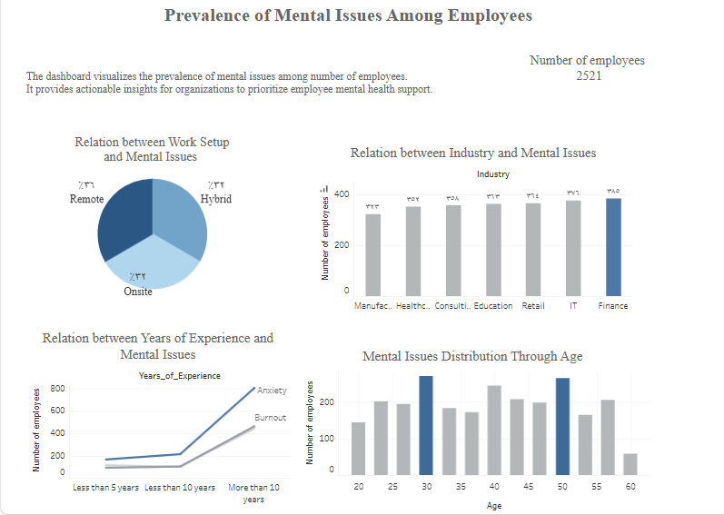
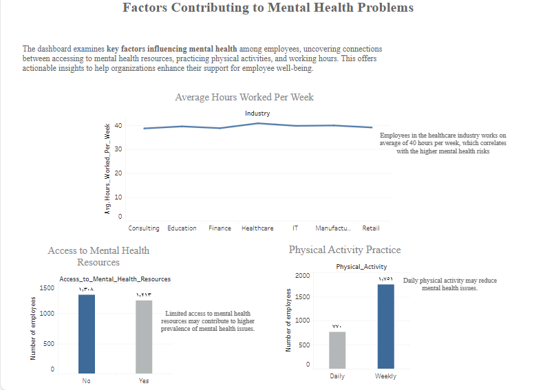

# 🧠 Work and Mental Health Dashboard

This project analyzes how remote work impacts mental health using a global dataset. The goal is to help organizations understand the prevalence and causes of issues like anxiety, depression, and burnout, and propose solutions to support employee well-being.

## 📌 Overview

- 📊 Dataset: [Remote Work & Mental Health](https://www.kaggle.com/datasets/waqi786/remote-work-and-mental-health/data)
- 🛠 Tools Used:
    - Python: Pandas, NumPy (data preprocessing)
    - Tableau: Interactive dashboard
    - Excel: Initial data review

### 🔍 Data Cleaning & Preprocessing
- Removed gender entries marked as "non-binary" or "prefer not to say" (to focus on binary gender analysis).
- Inferred missing `Mental_Health_Condition` values using related columns like:
  - Social isolation rating
  - Stress level
  - Remote work status
  - Work-life balance
  - Productivity change
- Filled missing physical activity values with the most common value.
- Removed outliers, standardized categorical variables, and validated experience vs age.

### 📊 Dashboard (Tableau)
📌 Live Dashboard: [Click to View](https://public.tableau.com/app/profile/razan.alonazi/viz/WorkandMentalHealth_17343622722510/Dashboard1)

The dashboard contains 6 visualizations grouped into two main sheets:

#### Sheet 1: Prevalence of Mental Issues
- Mental health by work setup (remote vs hybrid vs onsite)
- Mental issues by industry 
- Mental health by years of experience and age group

#### Sheet 2: Possible Causes
- High working hours = increased risk
- Lack of access to mental health resources = major factor
- Physical activity = protective factor against anxiety and burnout

## 📈 Key Insights

| Insight | Recommendation |
|--------|----------------|
| Remote work increases anxiety | Offer mental health check-ins for remote workers |
| Finance industry is most affected | Implement targeted wellness programs |
| Ages 30–50 & 10+ years experience are most at risk | Tailor support to senior employees |
| Long working hours are harmful | Monitor and limit overwork |
| Daily physical activity lowers risk | Promote exercise programs |
